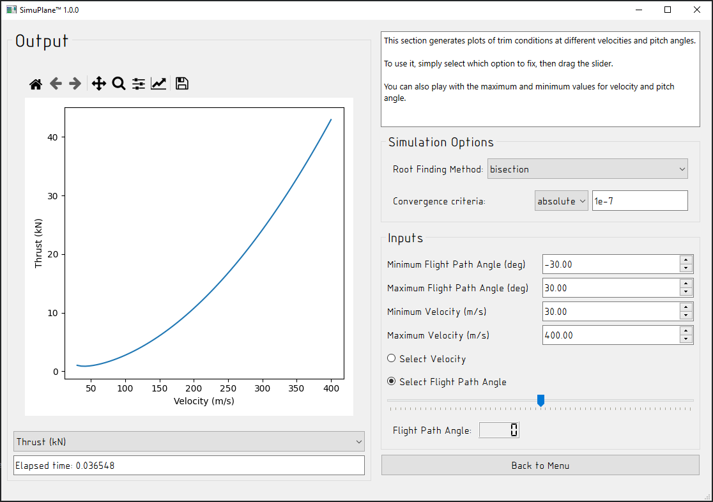

# SimuPlane

# Project Description
The aim of this project is to simulate the longitudinal dynamics of a small airplane. The airplane encounters aerodynamic forces and moments when in motion, this program provides the facilities to find the trim conditions of the airplane (where all forces are balanced, leading to no change over time), as well as  input commands to the airplane.

This project includes a Graphical User interface (GUI), wherein the user can input the trim conditions and the the flight commands, and obtain the response of the airplane. The response of the system can be a depicted by a series of graphs, in which the user can use a drop down menu to choose their desired graph.

Due to the complexity of this simultaion, various nuerical methods were employed to predict the response of the airplane. Python is used for this simulation, as it has a diverse set of packages and libraris that offer features for different simulation components.  

The GUI is written in PyQt, a binder for the original Qt, which was written in C++. PyQt was chosen for its Python flexibility and its robust Qt framework.

# How to use the project

YOU WILL NEED PYSIDE6 INSTALLED TO RUN THE GUI.

The simplest way to make sure you have all the requirements is to create a virtualenv:

```sh
python -m venv venv
./venv/Scripts/activate  # may vary depending on platform, eg. run venv/bin/activate.sh on linux
pip install -r requirements.txt
```

Then, to launch the application, make sure that you're in the top folder of the project and run

```sh
python simlib/main.py
```

This takes you to the GUI application, which has options to simulate an airplane, find equilibrium trims at different velocities and angles of attack, and to find the length of time necessary to climb a certain distance.

Most of the files in `simlib/source`` can be run on their own to produce sample output for testing and verification.

## Shortcuts 
[Start Menu]
Start Simulation: Ctrl + S
Find Climb Time: Ctrl + F
Quit: Ctrl + Q


[Simulation Window]
Add Trim: Return
Delete Prev: Ctrl + Del
Clear All: Alt + Del
Run Simulation: Shift + Return
Back to Menu: Esc


[Find Climb Time Window]
Find Climb Time: Return
Reset: Ctrl + R
Back to Menu: Esc


[Find Trim Window]
Back to Menu: Esc


# Files in this repository

Files containing the airplane characteristics, aerodynamics, and the environment:
- aero_table.py
    - python files with the aerodynamics coefficients at discrete values of the angle of attack alpha and elevator angle delta_el
- env.py
    - Gravity and air density
- vehicle.py
    - Some airplane characteristics (Sref, airfoil chord, moment of inertia, mass) 

Code files:
- curve_fit.py
    - Linear and quadratic curve fitting
- diffeq.py
    - Solve ODEs
- root_finder.py
    - Find roots of equations
- command.py
    - User interface commands
- dynamics.py
    - code for the flight mechanics of the airplane
- gui_root_find.py
    - gui window for different trim conditions
- gui_root_finder_iterables.py
    - iterable-based root-finding library with various options
- gui_t_climb.py
    - GUI window to calculate the time for climb
- plot.py
    - Plotting functionality for various questions
- main.py
    - Main logic file, run to start the application


# Credits
This project was coded by Jasper Day, Kaartic Ramana Vengidesh, Mehmet Tasman, Niketa Silva Walichchoru Evayage, Shanilka Kannangara, Thomas Wang and Xavier Yi.
# Design Project Tasks

- Coding
    - Curve fitting (linear and polynomial) for experimental data (part 1 of part A)
        - Input: table of values (e.g., from `aero_tables.py`)
        - Output: list of coefficients for a linear or quadratic line of best fit
        - File: `curve_fit.py`
        - Method: Linear regression

    - Differential Equations numerical solver with state variables (part 3 of part A)
        - Input: State change equation, commands
        - Output: 2D array of state integrated through time
        - File: `diffeq_solver.py`
        - Method: Runge-Kutta 4th order

    - Equation solver (root finder) for trim conditions (part 2 of part A)
        - Input: Multivariate equation
        - Output: Roots of that equation
        - File: `root_finder.py`
        - Method: Bisection
